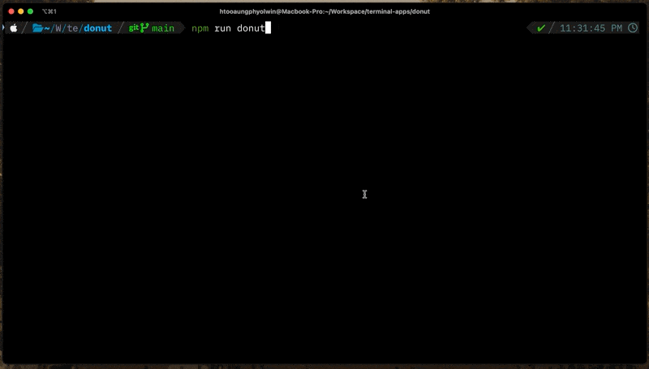

# Donut Terminal App

This is a simple terminal application written in TypeScript that renders a spinning 3D donut using ANSI escape codes.

## Screenshots



## Project Structure

- `src/donut/`: Contains the core logic for the donut animation.
  - `ansi.ts`: Handles ANSI escape codes for terminal manipulation.
  - `buffers.ts`: Manages the frame buffers for rendering.
  - `config.ts`: Configuration settings for the donut animation.
  - `index.ts`: The main entry point of the application, sets up terminal and starts the animation loop.
  - `loop.ts`: Manages the animation loop.
  - `math.ts`: Contains mathematical functions for 3D transformations.
  - `renderer.ts`: Handles rendering the donut to the terminal.
- `package.json`: Project metadata, scripts, and dependencies.
- `tsconfig.json`: TypeScript configuration.

## Installation

To install the dependencies, navigate to the project root and run:

```bash
npm install
```

## Usage

To run the application, navigate to the project root and run:

```bash
npm run donut
```

The application will start rendering the spinning 3D donut in the terminal. To exit, press `Ctrl+C`.

## Dependencies

This project uses the following dependencies:

- `typescript`: TypeScript compiler
- `ts-node`: TypeScript execution environment
- `@types/node`: TypeScript definitions for Node.js

## License

This project is licensed under the MIT License. For more information, please see the `License` file included in this repository.
